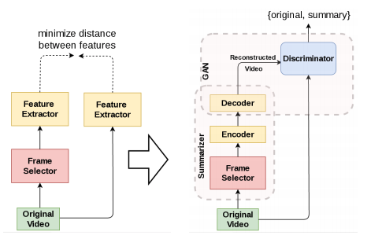
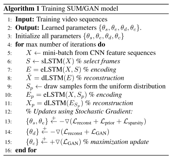

# Adversarial_Video_Summary

## PyTorch Implementation of SUM-GAN
- from ["Unsupervised Video Summarization with Adversarial LSTM Networks  (CVPR 2017)"](http://web.engr.oregonstate.edu/~sinisa/research/publications/cvpr17_summarization.pdf)
- by Behrooz Mahasseni, Michael Lam and Sinisa Todorovic
- Code Author: [Jaemin Cho](https://github.com/j-min)
- Used as baseline for unsupervised video summarization

## Changes from Original paper
- Video feature extractor
    - GoogleNet pool5 (1024) => ResNet-101 pool5 (2048)
    - Followed by linear projection to 500-dim
- Stable GAN Training
    - Discriminator's learning rate: 1e-5 (Others: 1e-4)
    - Fix Discriminators' parameters for first 15 steps at every epoch.

## Model figures

## Algorithm

